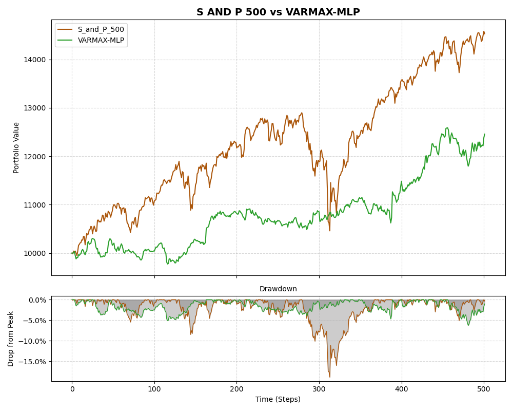
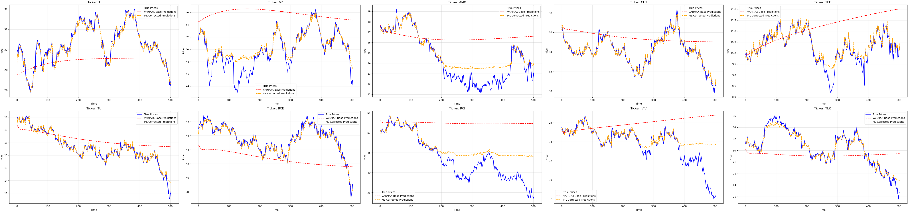

<div align="center">
  <h1>VARMAX-ML: Market-Neutral Hybrid Trading Strategies</h1>
  <h3>Daily Market-Neutral Strategies for the US Telecommunications Sector</h3>
</div>

[](https://www.python.org/)
[](https://opensource.org/licenses/MIT)
[]()

This project aims to implement a number of  daily long short market neutral strategies aimed at the US telecommunications equity sector. We extend the framework proposed by [Zhang (2003)](https://doi.org/10.1016/S0925-2312(01)00702-0) by using a Vector AutoRegression with Exogenous Variables as the linear baseline and an ML algorithm as a non-linear correction term. We demonstrate that atleast one of the strategies generated consistent alpha uncorrelated with the S&P500 using Monte Carlo Permutation Tests, Skewness Checks, Rolling Metrics and other Robustness CHecks. We were able to generate a strategy/ies that is low volatility and is suitable for leveraged portfolios.
The naming conventions to be used for ML models:
```
Long Short Term Memory = LSTM
MultiLayer Perceptron = MLP
Support Vector Regression = SVR
LightGBM = LGBM
GradientBoosting Regressor = GBR
```
Running the strategy and getting results:
1. Install requirements
```
pip install -r requirments.txt
```
1. Run the config file once.
2. Run [ML]-train-and-test.py to automatically run for a certain VARMAX-[ML] strategy:
    1. The ML training and Validation Loop
    2. Signal Generation
    3. Backtesting 
3. Run additional checks:  
    In **additionalchecks.py** set 
    ```python
    MODEL_NAME = "VARMAX-ML"
    ```
    replace `"ML"` with the ML model's name you want to implement.
4. Run Statistical significance tests(Monte Carlo Permutation tests) by running these three files:
    1. **statistical-significance-hybridvsvar.py** : For stat. sig. of Hybrid VARMAX-[ML] vs base VARX
    2. **statistical-significance-sandp.py** : For stat. sig. of VARMAX-[ML] / VARX against S&P500
    3. **statistical-significance.py** : For stat. sig. of VARMAX-[ML] / VARX against random signals  

    For all three set these constants:
    ```python
    MODEL_NAME = "VARMAX-ML"
    PERCENT_SIG = 0.05 #or 0.1
    N_RUNS = 5000 #number of iterations, higher the better
    ```
The figures below demonstrate the effectiveness of our hybrid VARMAX-MLP approach compared to traditional benchmarks.

### Equity Curve: Strategy vs S&P 500

*Comparison of the VARMAX-MLP portfolio's cumulative returns (equity-drawdown) against the S&P 500.*

### Time Series Forecasting: True vs Predicted

*Predicted values generated by the VARMAX-MLP hybrid model versus the true time series on the test set.*
## 📂 Repository Structure

```text
VARMAX-ML/
├── config/
│   └── config.py                           # Global variables and hyperparameters
├── data/
│   ├── image_for_github/                   # Images and banners used in the README
│   ├── predictions/                        # Raw prediction outputs (.npy format)
│   │   ├── model_predictions/              # Extracted time-series predictions
│   │   └── portfolio_predictions/          # Outputted equity curves / portfolio states
│   └── raw_data/                           # Raw datasets, market caps, and ticker lists
├── docs/
│   └── Report.pdf                          # Comprehensive project report and methodology
├── figures/
│   ├── model_figures/                      # Visual comparisons of True vs Predicted values
│   └── portfolio_figures/                  # Equity curves, drawdown, and S&P 500 comparisons
├── saved_models/                           # Serialized model weights (.joblib files)
│   ├── hybrid/                             # VARMAX-ML hybrid combinations
├── saved_params/                           # Optimized model hyperparameters saved as JSON
├── src/                                    # Core source code and execution scripts
│   ├── additional-checks.py                # Robustness checks and skewness tests
│   ├── backtesting.py                      # backtesting
│   ├── engineer_features.py                # Feature engineering and transformation
│   ├── metrics.py                          # Financial and statistical evaluation metrics
│   ├── model_factory.py                    # Factory logic for model creation
│   ├── plots.py                            # Matplotlib/Plotly visualization utilities
│   ├── preprocessors.py                    # Data scaling and normalization
│   ├── storageManager.py                   # I/O utilities for saving/loading assets
│   ├── strategies.py                       #  strategies(redundant)
│   ├── [ml]-train-and-test.py              # ML specific pipelines (gbr, lstm, mlp, lgbm, svr)
│   ├── varmax-train-and-test.py            # Base linear model pipeline
│   └── statistical-significance*.py        # Monte Carlo Permutation test scripts
├── statistics/
│   ├── data_statistics/                    # Exploratory data analysis stats
│   ├── model_statistics/                   # Forecast performance (MSE, RMSE, etc.)
│   └── portfolio_statistics/               # Trading metrics (Sharpe, Drawdown, Calmar)
├── .env                                    # Environment variables (do not commit)
├── .gitignore                              # Git ignore rules
├── README.md                               # Project documentation
└── requirements.txt                        # Core Python dependencies